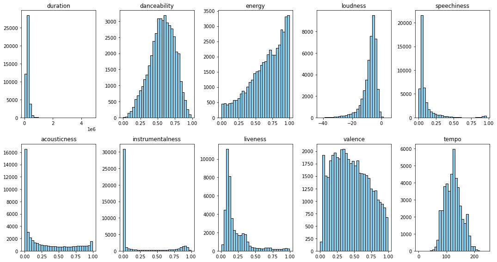
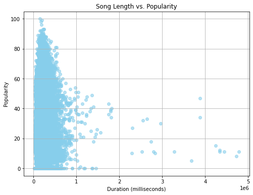

# Spotify Analysis
Data Science Capstone project analyzing various qualities of 52,000 Spotify songs. 

To pre-process the data, I began by loading the csv file ‘spotify52kData.csv’ as a pandas dataframe. After doing this, I had to ensure that there was no missing data, and if there was, I had to handle it. To check if there were missing values, I used the df.isnull() pandas function for each value in the dataframe. I summed all these “null” values (cells containing NaN or ‘None’) and found that the total was 0, indicating that there are no missing values in this dataset. My second problem to assess was whether or not there were duplicate records in the dataset. I decided that if more than one song in different rows shared the same album name and song name, they should be considered duplicates and all but one should be deleted. From doing this I found that there were actually 6,471 duplicate rows in this dataset, leaving me with 45,259 unique records to work with. However, an issue that I faced when examining these duplicates is that I noticed that two songs may have the same track name, album name, duration, etc… but have differing popularity ratings. In order to address this problem, I replaced the unique row’s popularity value with the mean of its popularity score and the popularity scores of its now deleted duplicates. 

Question 1:
To determine whether these 10 song features are distributed normally, I created one 2x5  histogram per feature to illustrate the nature of their distributions. I used the python library matplotlib to do this. By creating these histograms, I was able to visualize that both danceability and tempo appear to be roughly normally distributed, but none of them look quite like perfect normal distributions. 

Figure 1: Histograms of the distributions for the 10 song features of interest

Question 2: 
To examine the relationship between song length and popularity of a song, I created a scatter plot with song duration (milliseconds) on the x-axis and Spotify’s popularity metric (0-100) on the y-axis. I created this scatterplot using the matplotlib library. Once creating the scatterplot, I could visualize that there was likely little to no relationship between these two variables, however to confirm this, I calculated Spearman’s and Pearson’s correlation coefficients and found that ⍴ = -0.05075177699292398 and  r = -0.06557678618430361, indicating that there is a very weak negative linear correlation and an even weaker negative monotonic correlation between song length and popularity. 

Figure 2: Scatterplot of Song Length vs Popularity  			

Figure 3: Spearman’s rank Pearson correlation coefficient (r) output from python 

	

Question 3: 
Explicitly rated songs are more popular than non-explicitly rated songs. To determine this, I conducted a one-sided significance test. To decide which type of significance test to use, I graphed the popularity distributions for both explicit and non-explicit songs (figure 4). Because both of these distributions appeared to be non-normal, I decided to use the non-parametric Mann-Whitney U test. In order to separate the two categories, I did a for loop adding all the explicit songs to one list and all of the clean songs to another. I then used the scipy stats library to conduct this test between the two groups in python. I did a right-sided test to see whether the explicit songs were more popular and I got a p-value of 5.645175527228089e-17. This p-value is less than the 𝛼-value of  0.05 so we can reject the null hypothesis and conclude that explicitly rated songs are more popular than not explicit songs. 

Figure 4: Distributions of popularity for explicit and non-explicit songs 

       Figure 5: p-value for One-Sided Mann-Whitney U test

Question 4:
Similar to the previous question, to determine whether songs in a major key were more popular than songs in a minor key, I also conducted another Mann-Whitney test due to the fact that the data weren’t normally distributed. The song feature in the dataset for major/minor is represented by “mode”. While the values in the mode category are numerical, these numbers are not to be processed as numerical. The values in this column, “1” and “0” encode for whether the song is in a major and minor key, respectively. In order to separate the two categories, I did a for loop adding all the major-key songs to one list and all of the minor-key songs to another. I then used the scipy stats library to conduct this test between the two groups in python. I did a right-sided test to see whether the songs in a major key were more popular and I got a p-value of 0.9999985534626182. This p-value is greater than the 𝛼-value of 0.05 so we fail to reject the null hypothesis and therefore can’t conclude that songs in a major key are more popular than those in a minor key. 

Figure 6: Distributions of popularity for major and minor key songs 

Figure 7:  p-value for One-Sided Mann-Whitney U test

Question 5
To see whether energy reflects the loudness of a song, I created a scatter plot with energy on the x-axis and loudness on the y-axis. I added a best-fit line and also calculated the Pearson correlation coefficient in python. Visually, there was a pretty clear positive, somewhat linear, correlation. The calculated Pearson coefficient was 0.7718006538239947 which indicates a somewhat strong positive linear relationship. Similarly, the Spearman’s rank coefficient of 0.7354686476860166 indicates a relatively strong positive monotonic relationship. This result leads me to believe that energy does reflect the loudness of a song.

Figure 8: Scatter plot of Energy vs. Loudness  	

Figure 9: Pearson Correlation coefficient (r) and Spearman’s Rank Coefficient (⍴) for figure 8
 
Question 6
To figure out which of the ten song features predicts popularity the best, I performed a linear regression on each of the features. I did this using sklearn. With the ten results, I printed the R2 value for each to see which model predicts popularity the best. Additionally, I calculated the RMSE of each feature  to assess the error in this model. An ideal predictor would have both a high R2 and a low RMSE, and I found that the song feature that happened to hold both of these traits was “instrumentalness”. Of the ten features, instrumentalness had the highest R2 at 0.02402697572060386 and the lowest RMSE at 20.453778981797985. While it was the highest R2 of the ten, this is still a very low value. This number suggests that  only ~2% of the variation in the model is explained by instrumentalness which is not very good. 

Figure 10: R2 and RMSE values for each of the 10 features

Figure 11: Linear regression for instrumentalness

Figure 12: Features with lowest RMSE and highest R2.

Question 7: 
I used ordinary least squares multiple regression to build a model that predicts popularity. In this model, I incorporated all ten of the features from Q1 as predictors. This model has an R2 of 0.049, which is almost 0.025 larger than the R2 value for instrumentalness in the previous question, however, this is still very low. While the multiple linear regression did increase the R2 value, this model illustrates that only 4.9% of the variability in the model is explained by these ten song features, which is not very good. This makes sense because when analyzing a song, its popularity is not determined by one single factor, say, acousticness. And while this model still doesn’t do a great job of predicting popularity, it shows that there is some improvement when attempting to predict popularity based on more than one song trait. Also, it is important to acknowledge that this slight increase in R2 might be due to multicollinearity between the predictors. 

Figure 13: Multiple Linear Regression Summary 

Figure 14: R2 of Multiple Linear Regression 

Question 8: 
I conducted a principal component analysis (PCA) to determine how many principal components I could extract from this dataset.  First, I z-scored the data because PCA assumes that it is being given data that is normally distributed and mean calibrated. Then, I printed the correlation matrix so that I could visualize that there are in fact some distinct clusters/correlations within the features. Next, I calculated the eigenvalues for each feature and from that, the proportion of explained variance for each feature (fig. 15). Using these eigenvalues, I then created a scree plot which is a bar chart of the eigenvalues in decreasing order. I used the Kaiser-criterion method to see how many principal components there were and because the first three bars were above the line of y = 1, there were determined to be 3 principal components. I then created 3 loading plots to see what the principal components were and I found that they were duration, mood (danceability + valence), and vocalization (liveness + speechiness). To calculate the proportion of the variance the principle components accounted for, I summed the largest three values from figure 15 (27.339+16.174+13.846) and got a result of ~57.55% of the variance. 

Figure 15: Correlation matrix  	     Figure 16: Variance Explained per Feature	    Figure 17: Scree plot

Figure 18-20: Loading Plots for the 3 Principal Components 

Question 9: 
I conducted logistic regression to see if valence could predict whether a song was in a major or minor key. From doing this, I got an accuracy score of 0.6215201060539107 and an area under the ROC curve of 0.5183279864211465. This indicates that valence is not a very good predictor of the key of a song. To see if any of the other 10 features predicted the key of a song better, I repeated this logistic regression, looping through the other 9 song features. Below, in fig. 23, you can see that all of the features had an accuracy of 0.6215201060539107, and the AUROC values ranged from ~0.46-0.58. None of these numbers are indications of a particularly strong predictor, so I would say that none of these features are great predictors of song key. 

Figure 21: Logistic regression curve 		Figure 22: Logistic regression curve for predicting the  
For predicting key from valence                                                        Other 9 features                  

Figure 23: AUROC and Accuracy for the 10 features

Question 10: 

To test whether duration, or the principal components extracted from question 8 were better predictors of whether a song is classical or not, I conducted logistic regression. Before doing this, I had to assign values of 0 and 1 for the track_genre column. 1 for if a song was classical, and 0 for if it was not. I had to do this because logistic regression is used for binary outcomes. For duration, I got an accuracy score of 0.9806672558550596 and AUROC of 0.6082466727819887. For the principal components, I got an accuracy of 0.9783473265576668 and AUROC of 0.9248906483850722. Both predictors had a very high accuracy, however the area under the ROC curve is a stronger measure of how good a predictor is. So, looking at the AUROC values, the AUROC for the principal components is significantly higher than the AUROC for duration. This indicates that the principal components are a better predictor of whether a song is classical or not. 

Figure 24: Accuracy and AUROC for logistic regression for predicting genre from duration vs accuracy and AUROC for logistic regression for predicting genre from the principal components  

Extra Credit: 
I was curious to see if songs whose track title is the same as their album title, are more popular, on average than songs whose track title and album title are not the same. The reason behind this thinking, is that from my observations, songs that have their album’s title are typically the single of the album, and therefore, I would think they would be more popular. To test this, I made two new data frames, one included all of the songs that had matching track and album titles, and then the other included the rest of the songs (non-matching titles). I performed a Mann-Whitney U test on this data to see whether or not there was a significant difference between these two groups. I chose this test because as shown by the distributions below, the songs with different album and track names are clearly not normally distributed. I did a one-sided significance as I was specifically interested in whether or not the songs in the matching titles dataframe were more popular than the other songs. Doing this test, I got a p-value of 0.0, indicating that there is significant evidence that songs with the same album and track titles are more popular than songs with different album and track titles. 

Figure 25: Distributions of popularity for matching titles & different titles

                    Figure 26: p-value of Mann-Whitney U test 

